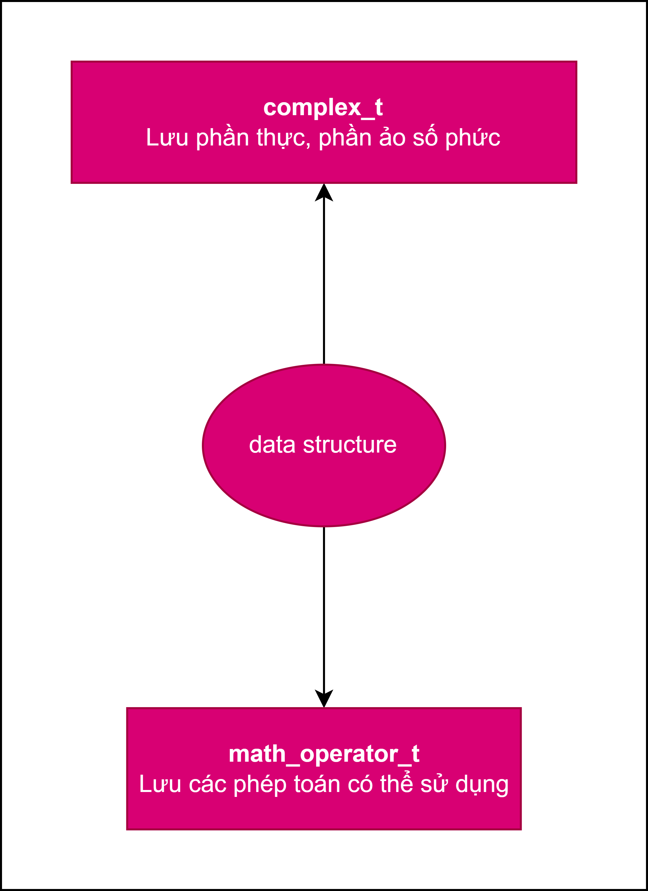
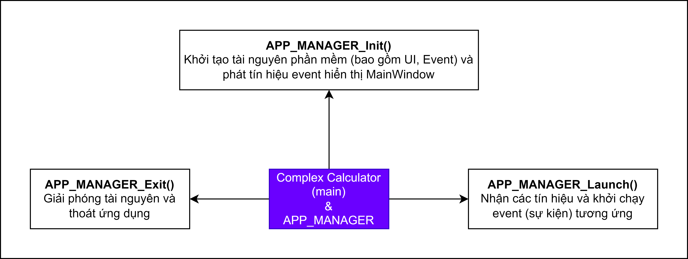
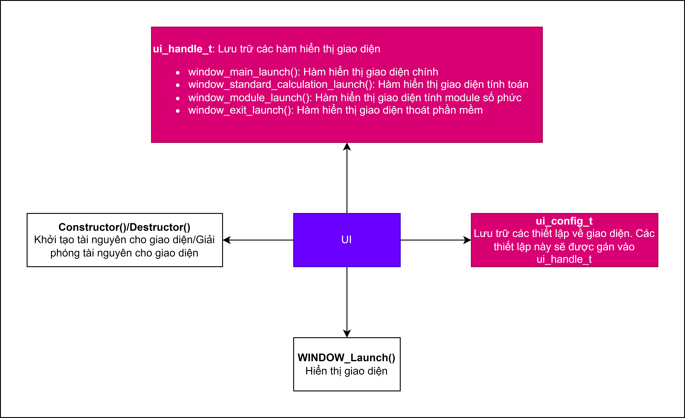
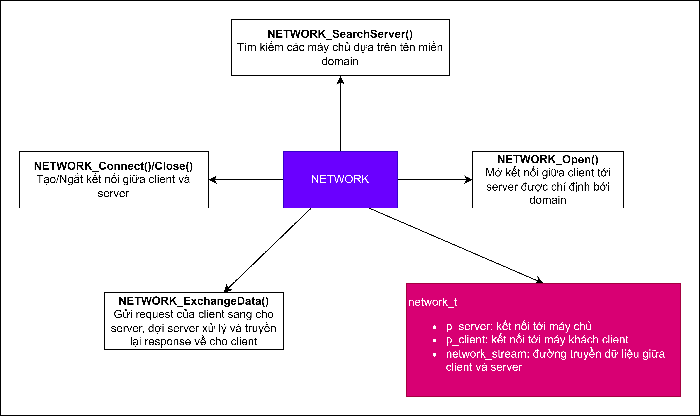
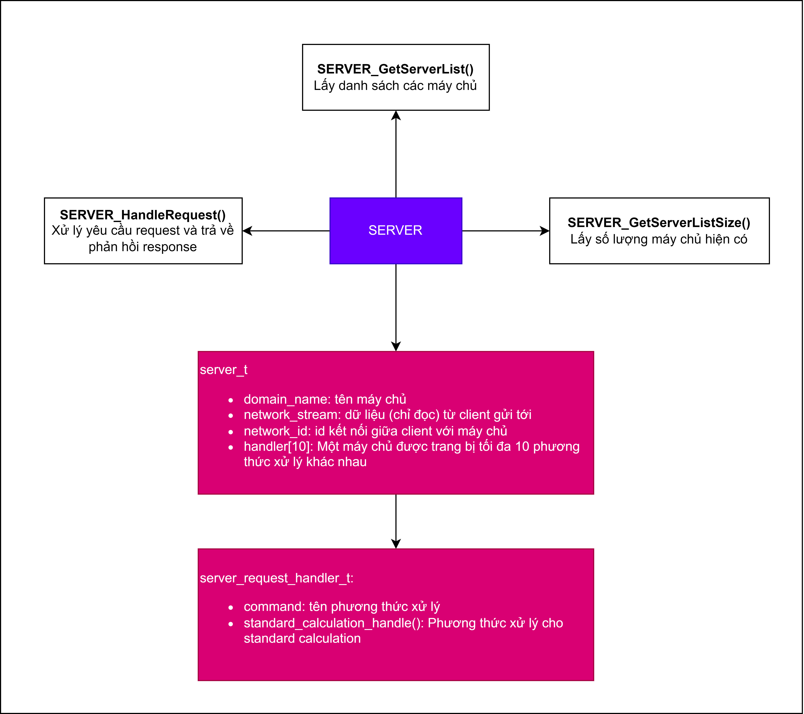
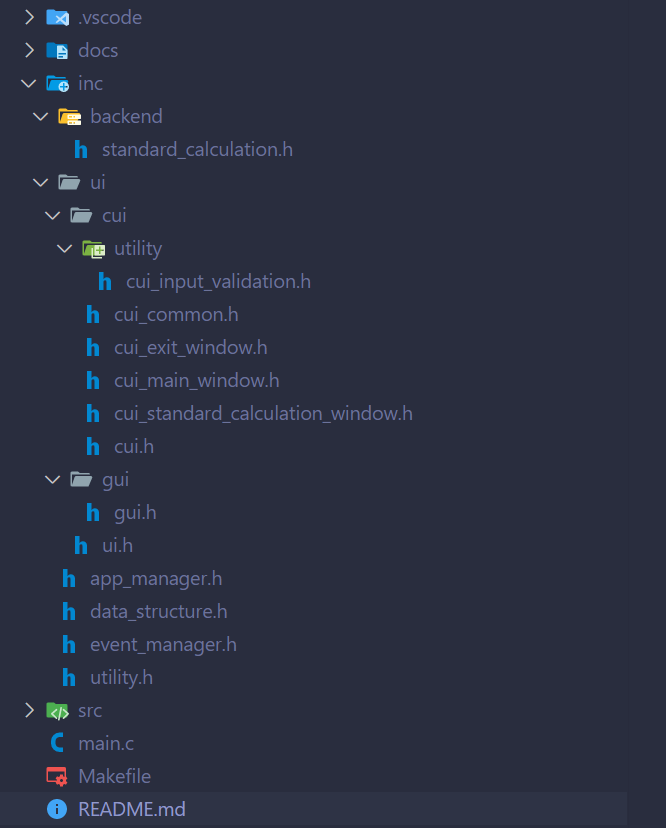

# COMPLEX CALCULATOR

## **1. Mô tả thiết kế phần mềm**

Phần mềm Complex Calculator là một máy tính số phức với các chức năng cơ bản bao gồm: 

1. **Standard Calculation**: Thực hiện các phép tính cơ bản như cộng, trừ, nhân, chia.
2. **Module**: Tính toán module của số phức.
3. **Exit**: Thoát khỏi chương trình.




## **2. Kiến trúc hệ thống**


Hệ thống Complex Calculator được thiết kế với các khối chức năng chính sau:

### **2.1. APP_MANAGER**

Khối APP_MANAGER quản lý toàn bộ phần mềm và bao gồm 3 bước chính:

- **`Init()` - Khởi tạo**: Bước khởi tạo các thành phần của phần mềm.
- **`Launch()` - Chạy**: Quản lý việc chạy ứng dụng và xử lý các sự kiện từ người dùng.
- **`Exit()` - Thoát**: Thực hiện thoát khỏi chương trình.



### **2.2 EVENT_MANAGER**

Khối EVENT_MANAGER tạo và nhận tín hiệu để hiển thị giao diện tương ứng với 4 sự kiện:

- **main window**: Sự kiện hiển thị giao diện chính.
- **standard calculation window**: Sự kiện hiển thị giao diện tính toán cơ bản.
- **module window**: Sự kiện hiển thị giao diện tính toán module.
- **exit window**: Sự kiện hiển thị giao diện thoát.


### **2.3. UI**

Khối UI bao gồm Command-line User Interface (CUI) và Graphical User Interface (GUI). 

> Khối UI được thiết kế bao gồm 4 giao diện: ***MainWindow***, ***StandardCalculationWindow***, ***ModuleWindow*** và ***ExitWindow***


- **CUI**: Giao diện dòng lệnh bao gồm 4 giao diện con. Mỗi giao diện con bao gồm 2 phần:
  - **Data**: Lưu trữ dữ liệu của giao diện đó.
  - **Window Management Function**: Các hàm khởi chạy giao diện, bao gồm 3 hàm `DisplayMenu()`, `GetInputFromUser()` và `HandleUserInput()`, được đóng gói thành một hàm duy nhất `Launch()`.

- **GUI** (Các học viên tự luyện): Giao diện đồ họa bao gồm 4 giao diện con. Mỗi giao diện con bao gồm 2 phần:
  - **Data**: Lưu trữ dữ liệu của giao diện đó.
  - **Window Management Function**: Các hàm khởi chạy giao diện, bao gồm nhiều hàm được đóng gói thành một hàm duy nhất `Launch()`.

***Người dùng có thể lựa chọn sử dụng giao diện CUI hoặc GUI.***


### **2.4. BACKEND**

Khối BACKEND bao gồm backend cho chức năng Standard Calculation và Module:

- **Standard Calculation**: Bao gồm 2 phần:
  - **Data**: Lưu trữ dữ liệu cho phần xử lý tính toán cơ bản.
  - **Backend Processing Function**: Các hàm xử lý tính toán.

- **Module**: Bao gồm 2 phần:
  - **Data**: Lưu trữ dữ liệu cho phần xử lý tính toán module.
  - **Backend Processing Function**: Các hàm xử lý tính toán.


### **2.5. MODULE NETWORK**

#### **2.5.1. NETWORK**

Khối NETWORK dùng để duy trì kết nối giữa máy chủ (server) với máy khách (client)



#### **2.5.2. CLIENT**

Khối CLIENT sẽ thiết lập một kết nối tới máy chủ thông qua tên miền (domain).
Dữ liệu và yêu cầu (request) sẽ được gửi từ client sang server theo định dạng
```
{request:<lệnh>,value:{<r> + <i>i,<r> + <i>i}}
```

Trong đó:
- `<lệnh>`:
  - "plus"
  - "subtract"
  - "multiply"
  - "divide"
- `<r>`: phần thực số phức
- `<i>`: phần ảo số phức

`VD: {request:plus,value:{165 + 2636i,-12.34252 + -485.252452i}}`


#### **2.5.3. SERVER**

Khối SERVER nhận request từ máy khách (client), lấy thông tin từ request gửi về backend xử lý, sau đó gửi lại phản hồi (response) gồm kết quả tính toán cho máy khách



## **3. Cấu trúc dự án**

Dưới đây là cây thư mục dự án hiện tại:



Thư mục ".vscode" chứa các file đã cấu hình sẵn IntelliSense Visual Studio Code. Ngoài ra, các file còn lại được chia thành các nhóm chức năng sau:

**Thư mục gốc**

* `docs`: Chứa tài liệu liên quan tới dự án.
* `module`: Chứa các module client, server, network
* `inc`/`src`: Chứa các file khai báo hàm/mã nguồn cho Complex Calculator
    * `main.c`: Chứa nơi bắt đầu khởi chạy phần mềm.
    * `app_manager.h/.c`: Chứa mã nguồn về trình tự khởi chạy của phần mềm.
    * `event_manager.h/.c`: Chứa mã nguồn về các sự kiện quyết định giao diện nào sẽ được hiển thị
    * `data_structure.h`: Các cấu trúc dữ liệu của Complex Calculator
    * `utility.h`: Các tiện ích cho việc lập trình, ở đây chứa tiện ích `LOG()` dùng để in ra màn hình console nhằm dễ dàng trong quá trình gỡ lỗi.
    * `backend`: Chứa mã nguồn cho phần lõi của Complex Calculator.
        * `standard_calculation.h/.c`: Chứa các định nghĩa cho các hàm tính toán cơ bản.
    * `ui`: Chứa các file liên quan đến giao diện. Các giao diện này hoàn toàn độc lập với chức năng (backend) của hệ thống.
        * `cui`: Chứa các định nghĩa cho giao diện người dùng console.
            * `utility`: Chứa các định nghĩa cho các tiện ích giao diện người dùng.
                * `cui_input_validation.h/.c`: Chứa các định nghĩa cho các hàm yêu cầu đầu vào người dùng từ console.
            * `cui.h`: Tổng hợp toàn bộ các file cần thiết cho CUI, các module khác chỉ cần `#include "cui.h"`.
            * `cui_common.h`: Chứa các định nghĩa cho các cấu trúc dữ liệu và khai báo hàm chung của giao diện console.
            * `cui_main_window.h/.c`: Chứa các định nghĩa cho cửa sổ chính của giao diện người dùng console.
            * `cui_standard_calculation_window.h/.c`: Chứa các định nghĩa cho cửa sổ tính toán cơ bản của giao diện người dùng console.
            * `cui_exit_window.h/.c`: Chứa các định nghĩa cho cửa sổ thoát giao diện người dùng console.
        * `gui`: Chứa các định nghĩa cho giao diện người dùng đồ họa.
            * `gui.h`: Chứa các định nghĩa cho giao diện người dùng đồ họa.
* `Makefile`: Chứa lệnh biên dịch và chạy Complex Calculator
* `README.md`: Mô tả dự án.

**Lưu ý**

* Các file header có phần mở rộng `.h` thường chứa các **khai báo** cho các cấu trúc dữ liệu, hàm.
* Các file nguồn có phần mở rộng `.c` thường chứa **định nghĩa/khởi tạo** cho các hàm, biến.
* Tệp Makefile được sử dụng để tự động hóa việc biên dịch và chạy phần mềm.

## **4. Hướng dẫn chạy dự án**
- `cd` tới thư mục dự án (thư mục FinalExamProject)

- Chạy với Make:
    ```
    make clean build run
    ```
**Lưu ý:**
- Nếu chỉ muốn xóa thư mục build: `make clean`
- Nếu chỉ muốn biên dịch: `make build`
- Nếu chỉ muốn chạy: `make run`

## **5. Yêu cầu bài tập**

### **5.1. Tổng quan bài tập**

> **Yêu cầu tối thượng**: đọc hiểu toàn bộ ý tưởng và code của dự án

Hiện tại, Complex Calculator **đã có** những tính năng sau:

1. Có toàn bộ code cho giao diện CUI, tuy nhiên chưa có khởi tạo giao diện UI
2. Hỗ trợ tính cộng, trừ số phức ở cả Backend, UI và Event. Tuy nhiên Module Network chưa có sẵn
3. Hỗ trợ thoát chương trình ngay lập tức

Hiện tại, Complex Calculator có những tính năng sau **cần các học viên phải hoàn thiện**:

1. Khởi tạo giao diện UI - User Interface
2. Tạo giao diện CUI "Bạn có chắc chắn muốn thoát" cho tính năng thoát chương trình
3. Hoàn thiện Client, Server và Network để thiết lập được kết nối từ UI tới Backend thông qua Network
4. Lập trình Backend tính toán nhân, chia số phức và lập trình UI cho phép hiển thị kết quả nhân, chia số phức

### **5.2. Hướng dẫn thực hành**

#### ***5.2.1. Khởi tạo giao diện UI***
File `ui.c`, dòng 7: Cấp phát bộ nhớ cho p_ui_temp, sử dụng macro `UI_MemAlloc()` đã được định nghĩa trong `ui.h`. Nếu cấp phát thành công thì bộ nhớ này sẽ được gán lại cho p_ui_handler (đã được viết sẵn ở dòng 9)


#### ***5.2.2. Tạo giao diện CUI "Bạn có chắc chắn muốn thoát" cho tính năng thoát chương trình***

Biết rằng phần định nghĩa cho việc khởi chạy giao diện Exit nằm ở `cui_exit_window.h/.c`: Hãy tham khảo template từ các giao diện khác đã có như `cui_main_window.h/.c`, `cui_standard_calculation_window.h/.c` để hoàn thiện phần định nghĩa hàm trong `cui_exit_window.c`

#### ***5.2.3. Hoàn thiện Client, Server và Network để thiết lập được kết nối từ UI tới Backend thông qua Network***

Làm theo hướng dẫn được đặt sẵn trong `server.c`, `network.c`, `client.c`, `cui_standard_calculation_window.c` để hoàn thiện phần định nghĩa hàm

#### ***5.2.4. Lập trình Backend tính toán nhân, chia số phức và lập trình UI cho phép hiển thị kết quả nhân, chia số phức***

Biết rằng phần Backend nằm ở `standard_calculation.c`: Học viên cần tìm nơi nào chứa phần tính toán nhân chia và bổ sung thêm code

Biết rằng phần giao diện nằm ở `cui_standard_calculation_window.c`: Học viên cần tìm nơi nào chứa phần hiển thị kết quả nhân chia và bổ sung thêm code
